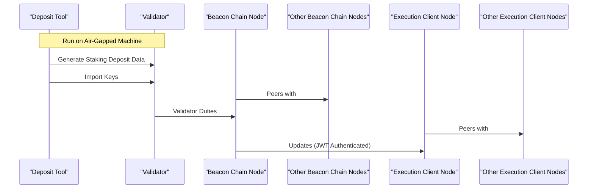

# Validator Guide: Readme

## Abstract

This series of documents provides guidance on setting up and managing an Ethereum Validator (including updating, pruning, etc.). Additionally, emergency protocols are provided in the case of an unrecoverable error on the node or the manager of a validator disappears (but the validator can be accessed).

This guide assumes use of MacOS on the connected device (LAN). While anyone can learn, this guide is meant for individuals who are tech savvy, and comfortable in command line without a GUI.

## Table of Contents

0. [Validator Readme](./README.md)
   - Background Information, Disclaimers
1. [Validator SOP Part 1: Hardware, Software, & Deposit Setup](./validator-sop-part1-setup.md)
   - Purchase Equipment and Assemble NUC
   - Generate Staking Data
   - Install Linux Server
   - Secure the Server
   - Configure Port Forwarding
   - Configure Timekeeping
   - Generate Client Auth Secret
   - Configure Geth
   - Install Prysm
   - Configure Beacon Node Service
   - Configure Validator Service
   - Import Validator Keys
   - Fund the Validator(s)
2. [Validator SOP Part 2: Upkeep, Updates, & Ongoing Management](./validator-sop-part2-upkeep.md)
   - Package Management Updates
   - Updating Geth
   - Updating Prysm
   - Pruning Geth
   - Exiting a Validator
   - Checking Sync Committee Duties
   - MEV Boost
3. [Validator SOP Part 3: Emergency Action Plans](./validator-sop-part3-emergency.md)
   - Validator Unrecoverable Error
   - Validator Operator Missing
   - Validator Operator Missing + No Validator Access

## Acknowledgements & Background Information

This guide is heavily based off of Somer Esat's [guides](https://someresat.medium.com), CoinCashew's [guides](https://www.google.com/url?sa=t&rct=j&q=&esrc=s&source=web&cd=&ved=2ahUKEwjxvYzFvZmCAxWhD1kFHcQiAH0QFnoECBQQAQ&url=https%3A%2F%2Fwww.coincashew.com%2Fcoins%2Foverview-eth%2Fguide-or-how-to-setup-a-validator-on-eth2-mainnet&usg=AOvVaw1dMCm5BKdKm5z7JoK1TDtD&opi=89978449), and the Stake Local Dashboard [guide](https://docs.stakelocal.io). We stand on the shoulders of those that came before us - thank you!

Overall flow of the guide is as follows:

- Generate the staking Deposit Data and Validator Keystore(s) **only if setting up a new validator**
- Prepare the Ubuntu Server (updates, firewall, security, etc.)
- Set up the Geth Execution Client node and sync it with the Ethereum mainnet
- Set up the Prysm Consensus Client and sync with other Beacon Nodes
- Deposit 32 ETH to activate the staking Validator(s) **only if setting up a new validator**
- Importing Validator Keystore(s) from depreciated Validator **only if re-creating a defunct or otherwise offline validator**
- Appendices covering updates, pruning, exiting
- Emergency Action Plans that cover the cases described above
- Monitoring instructions for use of Grafana locally

In addition to hardware as described in the next step, you should have a printed copy of the [Variables](.imgs/variables.xlsx) document, which will be used frequently to keep track of information that should **never be stored electronically or otherwise shared**.

## Disclaimer

1. **Choice of Tools**: Our preference for utilizing Geth and Prysm in this guide is driven by the necessity for robust security and reliability—imperatives for our nonprofit operations. These platforms come with a wealth of community support and have undergone extensive audits, testing, and updates. While our choice may seem to marginalize other minority clients, it is purely a decision made in the interest of asset security. This is not a reflection of the quality or potential of alternative clients as generally we support client diversity.

2. **Not Financial Advice**: This document is intended solely as a procedural guide for setting up and managing an Ethereum Validator. It should not be construed as financial advice or an endorsement of cryptocurrency investment. Always conduct your own research and consult with financial advisors before making any investment or taking actions you're unfamiliar with.

3. **Dynamic Nature of Content**: This guide, like the software it aims to assist you with, is a living document. As such, it is subject to modifications, revisions, and updates. Changes will be managed through approved pull requests in the associated GitHub repository. Users are encouraged to stay updated with the most recent version of this guide and the software it covers.

4. **User Responsibility**: Following this guide involves interacting with blockchain technology, which carries inherent risks. Endaoment assumes no liability for any losses or damages that may occur due to the use or misuse of this guide. Exercise due caution and ensure you understand each step before proceeding.

5. **Additional Resources**: This guide incorporates lessons and methodologies from reputable sources and practitioners in the field. However, it is advisable to consult multiple sources for a well-rounded understanding and general verification. ChatGPT can also be a great resource to check the validity of Linux CLI commands mentioned in this guide.

By proceeding with this guide, you acknowledge that you have read and understood the above disclaimers and risks. Endaoment is not responsible for how you choose to use this guide and/or any related documents.
