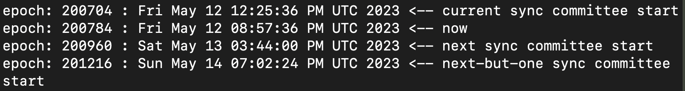
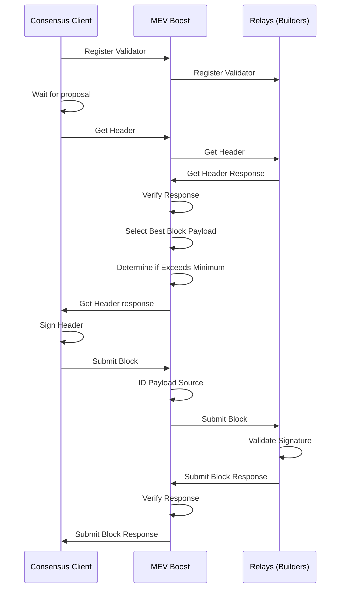

# Validator SOP Part 2: Upkeep, Updates, & Ongoing Management

## Table of Contents

- [Appendix A Package Management Updates](#appendix-a-package-management-updates)
- [Appendix B Updating Geth](#appendix-b-updating-geth)
- [Appendix C Updating Prysm](#appendix-c-updating-prysm)
- [Appendix D Pruning Geth](#appendix-d-pruning-geth)
- [Appendix E Exiting a Validator](#appendix-e-exiting-a-validator)
- [Appendix F Checking Sync Committee Duties](#appendix-f-checking-sync-committee-duties)
- [Appendix G MEV-Boost](#appendix-g-mev-boost)
  - [MEV Boost Set Up](#mev-boost-set-up)
  - [Update BeaconChain and Validator Software](#update-beaconchain-and-validator-software)
  - [Update MEV Boost](#update-mev-boost)

### Appendix A Package Management Updates

Regularly, you should run the following command on your Node:

```console
sudo apt update && sudo apt dist-upgrade && sudo apt auto-remove
```

This will:

- Update the package list for all configured repositories
- Upgrade all packages to their latest versions and install all new dependencies required by updated packages
- Remove any packages that were installed as dependencies that are no longer needed

Note that because it's a sudo command, you'll need to enter your password.

It is not irregular for your Node to prompt you to restart it after some particular updates are made. Sometimes this is requested after packages are updated, other times it's requested and shown to you upon your next login.

### Appendix B Updating Geth

First, go to the Geth Repository [here](https://geth.ethereum.org/downloads/) and right-click on the Geth for Linux button and then click copy link. Be sure to copy the correct link. It should look something like `https://gethstore.blob.core.windows.net/builds/geth-linux-amd64-1.13.11-8f7eb9cc.tar.gz`. Modify the URL in the instructions below to match the download link for the latest version (x5), which is v1.13.11 in this example (current as of 1.24.24).

```console
cd ~
curl -LO https://gethstore.blob.core.windows.net/builds/geth-linux-amd64-1.13.11-8f7eb9cc.tar.gz
```

Then stop the Geth service

```console
sudo systemctl stop geth
```

Note that stopping Geth always takes a moment and is not expected to complete immediately, don't stress, just be patient.

Now extract the files from the archive and copy to the /usr/local/bin directory. Modify the file name to match the downloaded version:

```console
tar xvf geth-linux-amd64-1.13.11-8f7eb9cc.tar.gz
cd geth-linux-amd64-1.13.11-8f7eb9cc
sudo cp geth /usr/local/bin
```

Next, restart the services and check for errors:

```console
sudo systemctl start geth
```

```console
sudo systemctl status geth # <-- Check for errors
sudo journalctl -fu geth # <-- Monitor
sudo journalctl -fu prysmbeacon # <-- Monitor
```

Finally, clean up the files, modifying the file name to match the downloaded version. Then check the Geth version to verify that all was installed correctly. This should match the Geth version shown on the repo site:

```console
cd ~
rm geth-linux-amd64-1.13.11-8f7eb9cc.tar.gz
rm -r geth-linux-amd64-1.13.11-8f7eb9cc
geth version
```

### Appendix C Updating Prysm

In order to update Prysm, we'll need to update both the validator and beacon-chain software.

First, let's check the latest version of Prysm available on their GitHub repo, which can be accessed [here](https://github.com/prysmaticlabs/prysm/releases). Be sure to copy the correct link, it should look something like `https://github.com/prysmaticlabs/prysm/releases/download/v4.2.1/beacon-chain-v4.2.1-darwin-amd64.sha256`. We will need to modify the commands below to match the latest version number, which is v4.2.1 in this example (current as of 1.30.24).

Curl the latest software and rename:

```console
curl -LO https://github.com/prysmaticlabs/prysm/releases/download/v4.2.1/validator-v4.2.1-linux-amd64
curl -LO https://github.com/prysmaticlabs/prysm/releases/download/v4.2.1/beacon-chain-v4.2.1-linux-amd64
mv beacon-chain-v4.2.1-linux-amd64 beacon-chain
mv validator-v4.2.1-linux-amd64 validator
```

Then stop the Prysm services:

```console
sudo systemctl stop prysmvalidator && sudo systemctl stop prysmbeacon
```

Then make the software executable, copy into the bin folder, and re-secure permissions:

```console
chmod +x beacon-chain
chmod +x validator
sudo cp beacon-chain /usr/local/bin
sudo cp validator /usr/local/bin
sudo chown -R prysmbeacon:prysmbeacon /var/lib/prysm/validator/ && sudo chown -R prysmvalidator:prysmvalidator /var/lib/prysm/validator/
```

Next, restart services and check for errors, then clean up the files:

```console
sudo systemctl daemon-reload
sudo systemctl start prysmbeacon
sudo systemctl start prysmvalidator
sudo rm beacon-chain && sudo rm validator
```

```console
sudo systemctl status prysmbeacon # <-- Check for errors
sudo journalctl -fu prysmbeacon.service # <-- Monitor
sudo systemctl status prysmvalidator # <-- Check for errors
sudo journalctl -fu prysmvalidator.service # <-- Monitor
```

Finally, check that you installed the right version. Note that this command may show you both the previous version and the current version. As long as both commands show the same data for the validator and beacon-chain software, you're all set:

```console
journalctl --since -1hour -u prysmvalidator.service | grep version
journalctl --since -1hour -u prysmbeacon.service | grep version
```

### Appendix D Pruning Geth

*As of 1.11.24, Geth does **not** have online pruning capability enabled by default (their 1.14 distribution should finally default to the path database , which will enable a new process, to be updated here after release).*

You must turn Geth off before pruning, meaning that pruning time is spent offline missing attestations. Before turning off Geth as part of this process, it's recommended to go through the flow described in *Appendix F* to ensure the validator(s) are not off during sync committee duties.

Note that you **must** have at least 50GB of free space to do this. You can check free space:

```console
df -h
```

First, stop Geth:

```console
sudo systemctl stop geth
```

Next, open a tmux session and start the pruning process:

```console
tmux
sudo -u goeth geth --datadir /var/lib/geth snapshot prune-state
```

Note that this is expected to take a decently long time, at least 3-4 hours even on an NVMe M.2 drive.

There are multiple operations occurring here: pruning state data, compacting database, etc. When you see the text "Database compaction finished" **and** "State pruning successful", you'll know the process has completed.

Finally, restart Geth:

```console
sudo systemctl start geth
```

You can also check Geth's status after restart to ensure it's running without error:

```console
sudo systemctl status geth
```

### Appendix E Exiting a Validator

To exit Validator(s), simply issue the following command and use the arrow keys to select the validator(s) you'd like to exit, and continue to follow the instructions presented (including entering your wallet password):

```console
sudo /usr/local/bin/validator accounts voluntary-exit --wallet-dir=/var/lib/prysm/validator
```

NOTE: It may take some time for the validators to exit, as issuing this command simply adds your validator to the exit queue. After a short amount of time you should be able to to check the status of the voluntary exit by searching for the validator on [Beaconcha.in](https://beaconcha.in/). Once the exit succeeds and you confirm receipt of the validator's ETH, you can stop all services on your Node and permanently shut down if you wish.

### Appendix F Checking Sync Committee Duties

Before performing maintenance (like pruning Geth, or updating Geth or Prysm), it is prudent to check upcoming sync committee duties (described up to [~27 hours in advance](https://github.com/ethereum/consensus-specs/pull/2453)) so as not to be offline when you would otherwise be part of a committee.

Run the following command, it will show something like the below:

```console
./check_sync_committee.sh 655257 655262 655258 655260 655226
```



If any of the validators (as identified by the validator index numbers in the command) have upcoming duties, there will be additional output below this that says *"validator: 123511 found in next sync committee"*. If no such text is present, the validators in question do not have upcoming sync duties.

Note that this requires the following script be set up and made executable:

```console
#!/bin/sh

BEACON_NODE="http://localhost:5052"
VALIDATOR_LIST=$(echo "$@" | tr ' ' '|')

epoch_to_time(){
    expr 1606824000 + \( $1 \* 384 \)
    }

time_to_epoch(){
    expr \( $1 - 1606824000 \) / 384
    }

get_committee(){
    URLSTEM="${BEACON_NODE}/eth/v1/beacon/states/finalized"
    curl -X GET "${URLSTEM}/sync_committees?epoch=$1" 2> /dev/null \
    | sed -e 's/["]/''/g' | cut -d'[' -f2 | cut -d']' -f1 | tr ',' '\n'
    }

search_committee(){
    get_committee $2 | grep -Ex $VALIDATOR_LIST \
    | awk -v c=$1 '{print "validator:", $1, "found in", c, "sync committee"}'
    }

display_epoch(){
    echo "epoch: $1 : $(date -d@$(epoch_to_time $1)) <-- $2"
    }

CURR_EPOCH=$(time_to_epoch $(date +%s))
CURR_START_EPOCH=`expr \( $CURR_EPOCH / 256 \) \* 256`
NEXT_START_EPOCH=`expr $CURR_START_EPOCH + 256`
NEXTB1_START_EPOCH=`expr $NEXT_START_EPOCH + 256`

echo
display_epoch $CURR_START_EPOCH   "current sync committee start"
display_epoch $CURR_EPOCH         "now"
display_epoch $NEXT_START_EPOCH   "next sync committee start"
display_epoch $NEXTB1_START_EPOCH "next-but-one sync committee start"
echo

if [ "$#" -gt 0 ]
then
    search_committee "current" $CURR_EPOCH
    search_committee "next"    $NEXT_START_EPOCH
fi
```

You can get this set up easily via:

```console
sudo nano check_sync_committee.sh
```

Then paste in the text of the script above, followed by:

```console
sudo chmod +x check_sync_committee.sh
```

to make the script executable.

### Appendix G MEV-Boost

MEV-boost (Maximal Extractable Value) is software that allows stakers to access MEV, earning them higher block rewards by using opensource middleware (MEV-boost by Flashbots) that allows access to the competitive block-building market. See more information about proposer-builder separation [here](https://ethresear.ch/t/proposer-block-builder-separation-friendly-fee-market-designs/9725).

There are trade-offs and choices to make in terms of which block-builders are used here, namely, *is the relay censoring aka OFAC compliant* and *is the relay ethical aka does it employ frontrunning and sandwich attack methods to increase MEV*. Endaoment and this guide do not support or otherwise condone the use of unethical or illegal MEV-boost practices.

While Endaoment will be using this software to increase staking rewards, we are of the opinion that MEV-burn is a preferable system where MEV-boost is rendered useless *(in this system, any and all MEV is automatically burnt, as opposed to being rewarded to randomly chosen proposer based on their willingness to run ethical or unethical MEV)*.



#### MEV Boost Set Up

Let's get to installing! All commands below are based on the current version of MEV-boost as of 12.15.23, v1.6, but should be adjusted based on whatever the latest version of MEV-boost is [here](https://github.com/flashbots/mev-boost/releases). Simply scroll to the bottom of the linked releases page, and right click the .tar.gz file that contains `linux_amd64`. Copy that link and replace all file names and links below.

Create mevboost service account:

```console
sudo useradd --no-create-home --shell /bin/false mevboost
```

Curl the MEV-boost build from the aforementioned link:

```console
cd ~
curl -LO https://github.com/flashbots/mev-boost/releases/download/v1.6/mev-boost_1.6_linux_amd64.tar.gz
```

For additional security, you can verify the checksum against the checksum found on the releases link above:

```console
sha256sum mev-boost_1.6_linux_amd64.tar.gz
```

Extract the files from the archive, copy to the /usr/local/bin directory, modify file names, and remove downloaded leftovers:

```console
tar xvf mev-boost_1.6_linux_amd64.tar.gz
sudo cp mev-boost /usr/local/bin
rm mev-boost LICENSE README.md mev-boost_1.6_linux_amd64.tar.gz
sudo chown mevboost:mevboost /usr/local/bin/mev-boost
```

Next, create and configure the service file:

```console
sudo nano /etc/systemd/system/mevboost.service
```

And then paste the following data into the file:

```console
[Unit]
Description=mev-boost ethereum mainnet
Wants=network-online.target
After=network-online.target

[Service]
User=mevboost
Group=mevboost
Type=simple
Restart=always
RestartSec=5
ExecStart=/usr/local/bin/mev-boost \
  -mainnet \
  -min-bid {MinBid} \
  -relay-check \
  -relay {RelayAddress} \
  -relay {RelayAddress} 

[Install]
WantedBy=multi-user.target
```

**Make sure** to replace {MinBid} with the minimum MEV bid required to use the block builder (else, you will build the block locally). Format this value like `0.05`.

**Make sure** to replace {RelayAddress} with the relay you would like to use to build your blocks for MEV. You can remove or add additional relay lines as needed - any listed relays will compete for the best MEV.

Press CTRL + X then Y then ENTER to save and exit.

Reload systemd to reflect the changes and start the service. Check the status to make sure it’s running correctly:

```console
sudo systemctl daemon-reload
sudo systemctl start mevboost
sudo systemctl status mevboost
```

If it says "active (running)" in green text, you've done it! Press Q to quit (this will not effect the mevboost service).

Use the journal output to follow the progress or check for errors by running the following command:

```console
sudo journalctl -fu mevboost
```

Finally, enable the service to automatically start on reboot:

```console
sudo systemctl enable mevboost
```

#### Update BeaconChain and Validator Software

In order to get the mevboost service to properly communicate with Prysm, we'll need to adjust both service files.

Open the prysmbeacon service file:

```console
sudo nano /etc/systemd/system/prysmbeacon.service
```

Add the following ExecStart command, depending on how you've formatted this file, you may need to add a backslash to delineate the lines:

```console
--http-mev-relay=http://127.0.0.1:18550
```

Press CTRL + X then Y then ENTER to save and exit.

Open the prysmvalidator service file:

```console
sudo nano /etc/systemd/system/prysmvalidator.service
```

Add the following ExecStart command, depending on how you've formatted this file, you may need to add a backslash to delineate the lines:

```console
--enable-builder
```

Press CTRL + X then Y then ENTER to save and exit.

Finally, reload and restart your services:

```console
sudo systemctl daemon-reload
sudo systemctl restart prysmbeacon prysmvalidator
```

Verify your logs look error-free and show use of the new MEV configurations.

```console
journalctl -fu prysmbeacon
journalctl -fu prysmvalidator
```

MEV-boost is now configured and set up!

#### Update MEV Boost

Before updating, always review the latest [MEV-boost release notes](https://github.com/flashbots/mev-boost/releases) for new requirements and any breaking changes. Typically, you need to ensure that you have the latest execution and consensus client versions installed in order for MEV-boost to work properly.

First, stop the service:

```console
sudo systemctl stop mevboost
```

The latest version of MEV-boost can be found [here](https://github.com/flashbots/mev-boost/releases). Simply scroll to the bottom of the linked releases page, and right click the .tar.gz file that contains `linux_amd64`. Copy that link and replace all file names and links below, which uses version 1.6, latest as of 12.25.23.

Curl the MEV-boost build from the aforementioned link:

```console
cd ~
curl -LO https://github.com/flashbots/mev-boost/releases/download/v1.6/mev-boost_1.6_linux_amd64.tar.gz
```

Extract the files from the archive, copy to the /usr/local/bin directory, modify file names, remove downloaded leftovers, and start the service back up:

```console
tar xvf mev-boost_1.6_linux_amd64.tar.gz
sudo cp mev-boost /usr/local/bin
rm mev-boost LICENSE README.md mev-boost_1.6_linux_amd64.tar.gz
sudo chown mevboost:mevboost /usr/local/bin/mev-boost
sudo systemctl start mevboost
```

Now, verify the service is running correctly and verify the correct version was installed:

```console
sudo systemctl status mevboost
mev-boost --version
```

Now you're really cooking.


