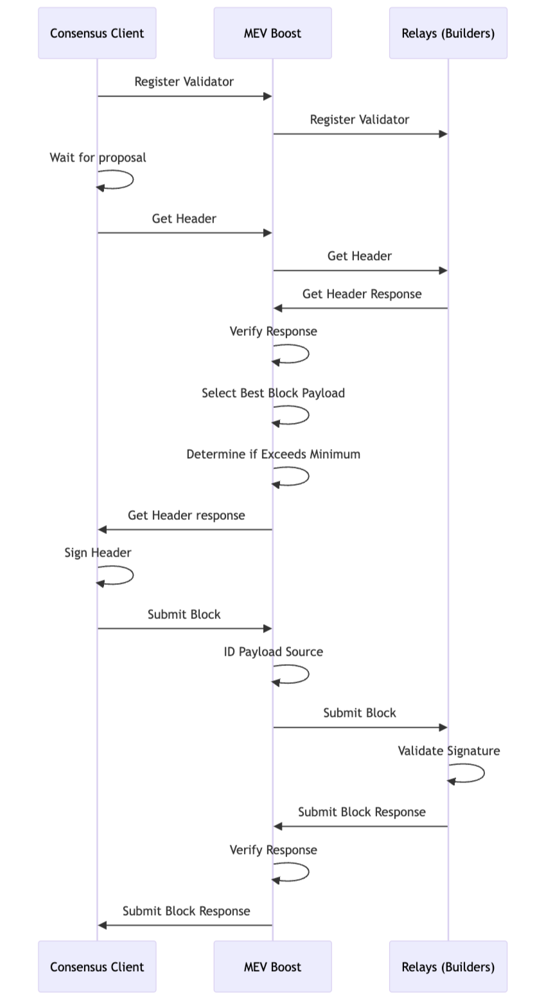

## Table of Contents

- [Appendix A Package Management Updates](/validators/validator-sop-part2-upkeep#appendix-a-package-management-updates)
- [Appendix B Updating Reth](/validators/validator-sop-part2-upkeep#appendix-b-updating-reth)
- [Appendix C Updating Prysm](/validators/validator-sop-part2-upkeep#appendix-c-updating-prysm)
- [Appendix D Exiting a Validator](/validators/validator-sop-part2-upkeep#appendix-d-exiting-a-validator)
- [Appendix E Checking Sync Committee Duties](/validators/validator-sop-part2-upkeep#appendix-e-checking-sync-committee-duties)
- [Appendix F MEV-Boost](/validators/validator-sop-part2-upkeep#appendix-f-mev-boost)
  - [MEV Boost Set Up](/validators/validator-sop-part2-upkeep#mev-boost-set-up)
  - [Update BeaconChain and Validator Software](/validators/validator-sop-part2-upkeep#update-beaconchain-and-validator-software)
  - [Update MEV Boost](/validators/validator-sop-part2-upkeep#update-mev-boost)
- [Appendix G Launchpad Validator Actions](/validators/validator-sop-part2-upkeep#appendix-g-launchpad-validator-actions)
- [Appendix H Resetting Reth Database](/validators/validator-sop-part2-upkeep#appendix-h-resetting-reth-database)

### Appendix A Package Management Updates

To maintain optimal performance and security of your Node, it is crucial to regularly execute the following command:

```
sudo apt update && sudo apt -y full-upgrade && sudo apt -y autoremove && sudo apt -y autoclean
```

This will:

- Update the package list for all configured repositories

- Upgrade all packages to their latest versions and install all new dependencies required by updated packages

- Remove any packages that were installed as dependencies that are no longer needed

- Clean up the package cache

- Not require your input (the -y flag prevents certain commands from being confirmed by you, you can feel free to remove if you'd like to see what will update and then permit that update in separate steps)

Note that because it's a sudo command, you'll need to enter your password.

It is not irregular for your Node to prompt you to restart it after some particular updates are made. Sometimes this is requested after packages are updated, other times it's requested and shown to you upon your next login.

### Appendix B Updating Reth

First, go to the Reth Repository [here](https://github.com/paradigmxyz/reth/releases) and expand the Assets section for the latest release. Copy the download link for the `reth-v...-x86_64-unknown-linux-gnu.tar.gz` file. Be sure to copy the correct link. It should look something like `https://github.com/paradigmxyz/reth/releases/download/v1.9.3/reth-v1.9.3-x86_64-unknown-linux-gnu.tar.gz`. Modify the URL in the instructions below to match the download link for the latest version, which is v1.9.3 in this example (current as of Nov 2025).

```
cd ~
curl -LO https://github.com/paradigmxyz/reth/releases/download/v1.9.3/reth-v1.9.3-x86_64-unknown-linux-gnu.tar.gz
```

Then stop the Reth service

```
sudo systemctl stop reth
```

Note that stopping Reth always takes a moment and is not expected to complete immediately, don't stress, just be patient.

Now extract the files from the archive and copy to the /usr/local/bin directory. Modify the file name to match the downloaded version:

```
tar xvf reth-v1.9.3-x86_64-unknown-linux-gnu.tar.gz
sudo cp reth /usr/local/bin
```

Next, restart the services and check for errors:

```
sudo systemctl start reth
```

```
sudo systemctl status reth # <-- Check for errors
sudo journalctl -fu reth | ccze # <-- Monitor
sudo journalctl -fu prysmbeacon | ccze # <-- Monitor
```

Finally, clean up the files, modifying the file name to match the downloaded version. Then check the Reth version to verify that all was installed correctly. This should match the Reth version shown on the repo site:

```
cd ~
rm reth-v1.9.3-x86_64-unknown-linux-gnu.tar.gz
reth --version
```

### Appendix C Updating Prysm

In order to update Prysm, we'll need to update both the validator and beacon-chain software.

First, let's check the latest version of Prysm available on their GitHub repo, which can be accessed [here](https://github.com/OffchainLabs/prysm/releases). Be sure to copy the correct link, it should look something like `https://github.com/OffchainLabs/prysm/releases/download/v7.1.2/beacon-chain-v7.1.2-linux-amd64.sha256`. We will need to modify the commands below to match the latest version number, which is v7.1.2 in this example (current as of 1/7/26).

Curl the latest software and rename:

```
curl -LO https://github.com/OffchainLabs/prysm/releases/download/v7.1.2/validator-v7.1.2-linux-amd64
curl -LO https://github.com/OffchainLabs/prysm/releases/download/v7.1.2/beacon-chain-v7.1.2-linux-amd64
mv beacon-chain-v7.1.2-linux-amd64 beacon-chain
mv validator-v7.1.2-linux-amd64 validator
```

Then stop the Prysm services:

```
sudo systemctl stop prysmvalidator && sudo systemctl stop prysmbeacon
```

Then make the software executable, copy into the bin folder, and re-secure permissions:

```
chmod +x beacon-chain
chmod +x validator
sudo cp beacon-chain /usr/local/bin
sudo cp validator /usr/local/bin
sudo chown -R prysmbeacon:prysmbeacon /var/lib/prysm/validator/ && sudo chown -R prysmvalidator:prysmvalidator /var/lib/prysm/validator/
```

Next, restart services and check for errors, then clean up the files:

```
sudo systemctl daemon-reload
sudo systemctl start prysmbeacon
sudo systemctl start prysmvalidator
sudo rm beacon-chain && sudo rm validator
```

```
sudo systemctl status prysmbeacon # <-- Check for errors
sudo journalctl -fu prysmbeacon.service | ccze # <-- Monitor
sudo systemctl status prysmvalidator # <-- Check for errors
sudo journalctl -fu prysmvalidator.service | ccze # <-- Monitor
```

Finally, check that you installed the right version. Note that this command may show you both the previous version and the current version. As long as both commands show the same data for the validator and beacon-chain software, you're all set:

```
journalctl --since -1hour -u prysmvalidator.service | grep version
journalctl --since -1hour -u prysmbeacon.service | grep version
```

**Verify blob storage migration:**

```
sudo ls -l /var/lib/prysm/beacon/blobs/
```

You should now see a line of text that looks something like `drwx------ 4 prysmbeacon prysmbeacon 4096 {MMM DD HH:MM} by-epoch`.

### Appendix D Exiting a Validator

As of May 2025, you can now use the [Ethereum Launchpad Validator Actions](https://launchpad.ethereum.org/en/validator-actions) to perform a validator exit via GUI. Note that you will need to be able to connect your withdrawal address to the site in order to proceed. If this is not possible or you would prefer to use the CLI method, please consult the [Prysm documentation](https://prysm.offchainlabs.com/docs/manage-validator/exiting-a-validator/). Otherwise, refer to Appendix G Launchpad Validator Actions.

#### Removing Exited Validators from Your Node

After a validator has fully exited and you've withdrawn your funds, you may want to remove its keys from the validator client. This will clean up your Grafana dashboard and stop tracking the exited validator.

First, list your current validator accounts to find the pubkey of the validator you want to remove:

```
sudo /usr/local/bin/validator accounts list --wallet-dir=/var/lib/prysm/validator
```

Then, stop the validator service, delete the specific key, and restart:

```
sudo systemctl stop prysmvalidator
sudo /usr/local/bin/validator accounts delete --wallet-dir=/var/lib/prysm/validator --delete-public-keys=0xYOUR_PUBKEY_HERE
sudo systemctl start prysmvalidator
```

Replace `0xYOUR_PUBKEY_HERE` with the full public key of the exited validator you want to remove. You can delete multiple validators at once by separating pubkeys with commas (no spaces).

**Note:** Only remove validators that have **fully exited** and whose funds have been withdrawn. Removing an active validator's keys will cause missed attestations and penalties.

### Appendix E Checking Sync Committee Duties

Before performing maintenance (like updating Reth or Prysm), it is prudent to check upcoming sync committee duties (described up to [\~27 hours in advance](https://github.com/ethereum/consensus-specs/pull/2453)) so as not to be offline when you would otherwise be part of a committee.

If any of the validators (as identified by the validator index numbers in the command) have upcoming duties, there will be additional output that says _"validator: 123511 found in next sync committee"_. If no such text is present, the validators in question do not have upcoming sync duties.

Note that this requires the following script be set up and made executable:

```
#!/bin/sh

# Set the URL of the local beacon node (Prysm default port)
BEACON_NODE="http://localhost:3500"

# Convert space-separated validator indices from command line arguments to a regex pattern
VALIDATOR_LIST=$(echo "$@" | tr ' ' '|')

# Function to convert epoch to Unix time
epoch_to_time() {
    expr 1606824000 + \( $1 \* 384 \)
}

# Function to convert Unix time to epoch
time_to_epoch() {
    expr \( $(date +%s) - 1606824000 \) / 384
}

# Function to get committee member indices from the Beacon Node API
get_committee() {
    URL="${BEACON_NODE}/eth/v1/beacon/states/finalized/sync_committees?epoch=$1"
    RESPONSE=$(curl -s -X GET "$URL")
    if [ -z "$RESPONSE" ]; then
        echo "Error fetching data from Beacon Node API."
        exit 1
    fi
    echo "$RESPONSE" | sed -e 's/["]/''/g' | cut -d'[' -f2 | cut -d']' -f1 | tr ',' '\n'
}

# Function to search for validator indices in the committee
search_committee() {
    COMMITTEE=$(get_committee $2)
    echo "$COMMITTEE" | grep -Ex $VALIDATOR_LIST \
    | awk -v c=$1 '{print "validator:", $1, "found in", c, "sync committee"}'
}

# Function to display the epoch and its corresponding date
display_epoch() {
    EPOCH_TIME=$(epoch_to_time $1)
    DATE=$(date -d @"$EPOCH_TIME" '+%Y-%m-%d %H:%M:%S')
    echo "epoch: $1 : $DATE <-- $2"
}

# Main operation
curr_epoch=$(time_to_epoch)
curr_start_epoch=$(expr $curr_epoch / 256 \* 256)
next_start_epoch=$(expr $curr_start_epoch + 256)
nextb1_start_epoch=$(expr $next_start_epoch + 256)

display_epoch $curr_start_epoch "current sync committee start"
display_epoch $next_start_epoch "next sync committee start"
display_epoch $nextb1_start_epoch "next-but-one sync committee start"

if [ "$#" -gt 0 ]; then
    search_committee "current" $curr_start_epoch
    search_committee "next" $next_start_epoch
    search_committee "next-but-one" $nextb1_start_epoch
fi
```

You can get this set up easily via:

```
sudo nano check_sync_committee.sh
```

Then paste in the text of the script above, save and exit, followed by:

```
sudo chmod +x check_sync_committee.sh
```

to make the script executable.

Also, run the following command to ensure you have prerequisite software set up:

```
sudo apt update && sudo apt install -y curl gawk sed coreutils
```

Run the following command, it will show something like the below:

```
./check_sync_committee.sh 655262 655258 655260 655226 1296208
```

[](../images/synccommittee.png)

### Appendix F MEV-Boost

MEV-boost (Maximal Extractable Value) is software that allows stakers to access MEV, earning them higher block rewards by using open-source middleware (MEV-boost by Flashbots) that allows access to the competitive block-building market. See more information about proposer-builder separation [here](https://ethresear.ch/t/proposer-block-builder-separation-friendly-fee-market-designs/9725).

There are trade-offs and choices to make in terms of which block-builders are used here, namely, _is the relay censoring aka OFAC compliant_ and _is the relay ethical aka does it employ frontrunning and sandwich attack methods to increase MEV_. Endaoment and this guide do not support or otherwise condone the use of unethical or illegal MEV-boost practices.

While Endaoment will be using this software to increase staking rewards, we are of the opinion that MEV-burn is a preferable system where MEV-boost is rendered useless _(in this system, any and all MEV is automatically burnt, as opposed to being rewarded to randomly chosen proposer based on their willingness to run ethical or unethical MEV)_.



#### MEV Boost Set Up

Let's get to installing! All commands below are based on the current version of MEV-boost as of 11.14.25, v1.10.1, but should be adjusted based on whatever the latest version of MEV-boost is [here](https://github.com/flashbots/mev-boost/releases). Simply scroll to the bottom of the linked releases page, and right click the .tar.gz file that contains `linux_amd64`. Copy that link and replace all file names and links below.

Create mevboost service account:

```
sudo useradd --no-create-home --shell /bin/false mevboost
```

Curl the MEV-boost build from the aforementioned link:

```
cd ~
curl -LO https://github.com/flashbots/mev-boost/releases/download/v1.10.1/mev-boost_1.10.1_linux_amd64.tar.gz
```

For additional security, you can verify the checksum against the checksum found on the releases link above:

```
sha256sum mev-boost_1.10.1_linux_amd64.tar.gz
```

Extract the files from the archive, copy to the /usr/local/bin directory, modify file names, and remove downloaded leftovers:

```
tar xvf mev-boost_1.10.1_linux_amd64.tar.gz
sudo cp mev-boost /usr/local/bin
rm mev-boost LICENSE README.md mev-boost_1.10.1_linux_amd64.tar.gz
sudo chown mevboost:mevboost /usr/local/bin/mev-boost
```

Next, create and configure the service file:

```
sudo nano /etc/systemd/system/mevboost.service
```

And then paste the following data into the file:

```
[Unit]
Description=mev-boost ethereum mainnet
Wants=network-online.target
After=network-online.target

[Service]
User=mevboost
Group=mevboost
Type=simple
Restart=always
RestartSec=5
ExecStart=/usr/local/bin/mev-boost \
  -mainnet \
  -min-bid {MinBid} \
  -relay-check \
  -relay {RelayAddress} \
  -relay {RelayAddress}

[Install]
WantedBy=multi-user.target
```

**Make sure** to replace `{MinBid}` with the minimum MEV bid required to use the block builder (else, you will build the block locally). Format this value like `0.05`.

**Make sure** to replace `{RelayAddress}` with the relay you would like to use to build your blocks for MEV. You can remove or add additional relay lines as needed - any listed relays will compete for the best MEV.

Press CTRL + X then Y then ENTER to save and exit.

Reload systemd to reflect the changes and start the service. Check the status to make sure it’s running correctly:

```
sudo systemctl daemon-reload
sudo systemctl start mevboost
sudo systemctl status mevboost
```

If it says "active (running)" in green text, you've done it! Press Q to quit (this will not affect the mevboost service).

Use the journal output to follow the progress or check for errors by running the following command:

```
sudo journalctl -fu mevboost | ccze
```

Finally, enable the service to automatically start on reboot:

```
sudo systemctl enable mevboost
```

#### Update BeaconChain and Validator Software

In order to get the mevboost service to properly communicate with Prysm, we'll need to adjust both service files.

Open the prysmbeacon service file:

```
sudo nano /etc/systemd/system/prysmbeacon.service
```

Add the following ExecStart command, depending on how you've formatted this file, you may need to add a backslash to delineate the lines:

```
--http-mev-relay=http://127.0.0.1:18550
```

Press CTRL + X then Y then ENTER to save and exit.

Open the prysmvalidator service file:

```
sudo nano /etc/systemd/system/prysmvalidator.service
```

Add the following ExecStart command, depending on how you've formatted this file, you may need to add a backslash to delineate the lines:

```
--enable-builder
```

Press CTRL + X then Y then ENTER to save and exit.

Finally, reload and restart your services:

```
sudo systemctl daemon-reload
sudo systemctl restart prysmbeacon prysmvalidator
```

Verify your logs look error-free and show use of the new MEV configurations.

```
journalctl -fu prysmbeacon | ccze
journalctl -fu prysmvalidator | ccze
```

MEV-boost is now configured and set up!

#### Update MEV Boost

Before updating, always review the latest [MEV-boost release notes](https://github.com/flashbots/mev-boost/releases) for new requirements and any breaking changes. Typically, you need to ensure that you have the latest execution and consensus client versions installed in order for MEV-boost to work properly.

**⚠️ Important:** MEV-Boost v1.10.1 is a required update for the upcoming Fusaka upgrade (epoch 411392, scheduled for Dec-03-2025 09:49:11 PM UTC). This version includes support for the new GetPayloadV2 API and Prometheus metrics.

First, stop the service:

```
sudo systemctl stop mevboost
```

The latest version of MEV-boost can be found [here](https://github.com/flashbots/mev-boost/releases). Simply scroll to the bottom of the linked releases page, and right click the .tar.gz file that contains `linux_amd64`. Copy that link and replace all file names and links below, which uses v1.10.1, latest as of 11.14.25.

Curl the MEV-boost build from the aforementioned link:

```
cd ~
curl -LO https://github.com/flashbots/mev-boost/releases/download/v1.10.1/mev-boost_1.10.1_linux_amd64.tar.gz
```

Extract the files from the archive, copy to the /usr/local/bin directory, modify file names, remove downloaded leftovers, and start the service back up:

```
sudo systemctl stop mevboost
tar xvf mev-boost_1.10.1_linux_amd64.tar.gz
sudo mv mev-boost /usr/local/bin
rm LICENSE README.md mev-boost_1.10.1_linux_amd64.tar.gz
sudo chown mevboost:mevboost /usr/local/bin/mev-boost
sudo systemctl start mevboost
```

Now, verify the service is running correctly and verify the correct version was installed:

```
sudo systemctl status mevboost
mev-boost --version
```

Now you're really cooking.

### Appendix G Launchpad Validator Actions

As of May of 2025, the [Ethereum Launchpad](https://launchpad.ethereum.org/) upgraded the list of actions you can take using the UI beyond simply making deposits into validators. If you navigate to the [Validator Actions](https://launchpad.ethereum.org/en/validator-actions) page and connect the wallet that represents your **withdrawal address**, you'll be able to select a current validator and take a number of different actions with it depending on your withdrawal credentials (`0x00`, `0x01`, or `0x02`).

- **Update account to compounding** - this process converts your existing `0x00` or `0x01` withdrawal credentials to `0x02` (new in the Pectra hard fork). Having `0x02` withdrawal credentials allows you to increase your effective balance from 32 ETH to 2048 ETH so that you need not spin up a new validator for each tranche. When you make this change, regular withdrawals will cease, and partial withdrawals may be requested using this UI (see "Request partial withdrawal" below). In addition, rewards will be based on your current validator balance and increase as that balance increases, essentially compounding your rewards.
- **Add funds to your validator** - only available to validators using `0x02` withdrawal credentials (see "Update account to compounding" above), this action allows you to add additional ETH to your validator that is currently held elsewhere. This allows compounding rewards, and has a minimum deposit amount of 1 ETH.
- **Request partial withdrawal** -  only available to validators using `0x02` withdrawal credentials (see "Update account to compounding" above), this action allows you to withdraw any portion of staked ETH over 32 to your withdrawal address.
- **Absorb another validator** -  only available to validators using `0x02` withdrawal credentials (see "Update account to compounding" above), this action allows you to transfer the entire balance of another validator you control to the one you have selected, consolidating those validators into one.
- **Migrate funds** -  this action allows you to transfer the entire balance of the validator you have selected to another one of your validators. The target consolidation validator must be using `0x02` withdrawal credentials (see "Update account to compounding" above).
- **Exit validator** - this action allows you to perform a full exit of your validator and withdraw the entire balance thereof.

### Appendix H Resetting Reth Database

In rare cases, you may need to reset the Reth database and re-sync from scratch. Common reasons include:

- **Database corruption** from power outages or hardware failures
- **Unclean shutdowns** that left the database in an inconsistent state
- **Storage format upgrades** when a new Reth version requires a fresh sync
- **Disk space recovery** if the database has grown unexpectedly large

<Warning>
**This will delete all synced execution layer data** and require a full re-sync, which can take hours to days depending on your sync method. Only proceed if other troubleshooting steps have failed.
</Warning>

#### Check If a Reset Is Necessary

Before resetting, try restarting Reth first—many issues resolve with a clean restart:

```
sudo systemctl restart reth
sudo journalctl -fu reth | ccze
```

If you see persistent errors like `Database corrupted`, `Checksum mismatch`, or `Failed to open database`, a reset may be necessary.

#### Reset the Database

First, stop the Reth service:

```
sudo systemctl stop reth
```

Remove all data from the Reth data directory:

```
sudo rm -rf /var/lib/reth/*
```

#### Re-sync Options

**Option 1: Sync from Genesis (Slower, Smaller)**

Simply restart Reth and it will begin syncing from genesis using the `--full` flag configuration:

```
sudo systemctl start reth
```

This takes 1-3 days but results in a smaller database (~1-2TB).

**Option 2: Use Merkle Snapshot (Faster, Larger)**

For faster recovery, use a [Merkle snapshot](/validators/validator-sop-part1-setup#optional-use-merkle-snapshot-for-faster-initial-sync) as described in Part 1. This reduces sync time to a few hours but results in a larger database.

#### Monitor Re-sync Progress

Watch the logs to monitor sync progress:

```
sudo journalctl -fu reth | ccze
```

Check sync status via JSON-RPC:

```
curl -X POST -H "Content-Type: application/json" --data '{"jsonrpc":"2.0","method":"eth_syncing","params":[],"id":1}' http://localhost:8545
```

A response of `{"jsonrpc":"2.0","id":1,"result":false}` indicates sync is complete.

**Note:** Your beacon chain will show errors until Reth finishes syncing. This is expected—once Reth catches up, the beacon chain will resume normal operation.
