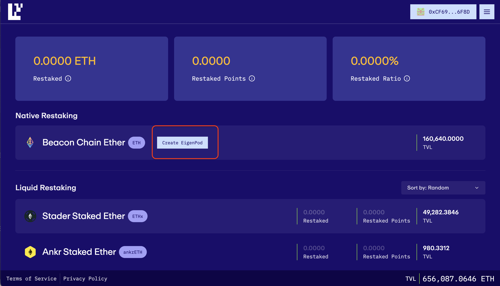
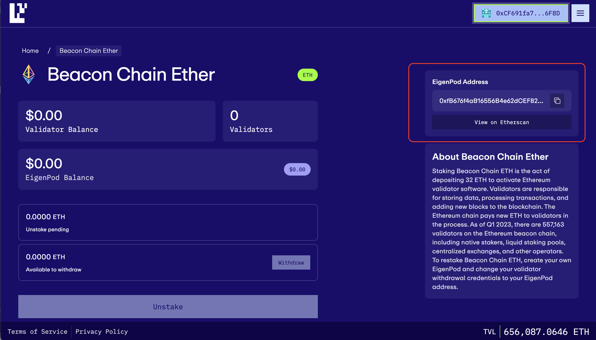

## Table of Contents

- [Appendix A Package Management Updates](/validators/validator-sop-part2-upkeep#appendix-a-package-management-updates)
- [Appendix B Updating Geth](/validators/validator-sop-part2-upkeep#appendix-b-updating-geth)
- [Appendix C Updating Prysm](/validators/validator-sop-part2-upkeep#appendix-c-updating-prysm)
- [Appendix D Pruning Geth](/validators/validator-sop-part2-upkeep#appendix-d-pruning-geth)
- [Appendix E Exiting a Validator](/validators/validator-sop-part2-upkeep#appendix-e-exiting-a-validator)
- [Appendix F Checking Sync Committee Duties](/validators/validator-sop-part2-upkeep#appendix-f-checking-sync-committee-duties)
- [Appendix G MEV-Boost](/validators/validator-sop-part2-upkeep#appendix-g-mev-boost)
  - [MEV Boost Set Up](/validators/validator-sop-part2-upkeep#mev-boost-set-up)
  - [Update BeaconChain and Validator Software](/validators/validator-sop-part2-upkeep#update-beaconchain-and-validator-software)
  - [Update MEV Boost](/validators/validator-sop-part2-upkeep#update-mev-boost)
- [Appendix H EigenLayer Native Restaking](/validators/validator-sop-part2-upkeep#appendix-h-eigenlayer-native-restaking)

### Appendix A Package Management Updates

To maintain optimal performance and security of your Node, it is crucial to regularly execute the following command:

```
sudo apt update && sudo apt -y full-upgrade && sudo apt -y autoremove && sudo apt -y autoclean
```

This will:

- Update the package list for all configured repositories

- Upgrade all packages to their latest versions and install all new dependencies required by updated packages

- Remove any packages that were installed as dependencies that are no longer needed

- Clean up the package cache

- Not require your input (the -y flag prevents certain commands from being confirmed by you, you can feel free to remove if you'd like to see what will update and then permit that update in separate steps)

Note that because it's a sudo command, you'll need to enter your password.

It is not irregular for your Node to prompt you to restart it after some particular updates are made. Sometimes this is requested after packages are updated, other times it's requested and shown to you upon your next login.

### Appendix B Updating Geth

First, go to the Geth Repository [here](https://geth.ethereum.org/downloads/) and right-click on the Geth for Linux button and then click copy link. Be sure to copy the correct link. It should look something like `https://gethstore.blob.core.windows.net/builds/geth-linux-amd64-1.14.8-a9523b64.tar.gz`. Modify the URL in the instructions below to match the download link for the latest version (x5), which is v1.14.8 in this example (current as of 8.12.24).

```
cd ~
curl -LO https://gethstore.blob.core.windows.net/builds/geth-linux-amd64-1.14.8-a9523b64.tar.gz
```

Then stop the Geth service

```
sudo systemctl stop geth
```

Note that stopping Geth always takes a moment and is not expected to complete immediately, don't stress, just be patient.

Now extract the files from the archive and copy to the /usr/local/bin directory. Modify the file name to match the downloaded version:

```
tar xvf geth-linux-amd64-1.14.8-a9523b64.tar.gz
cd geth-linux-amd64-1.14.8-a9523b64
sudo cp geth /usr/local/bin
```

Next, restart the services and check for errors:

```
sudo systemctl start geth
```

```
sudo systemctl status geth # <-- Check for errors
sudo journalctl -fu geth | ccze # <-- Monitor
sudo journalctl -fu prysmbeacon | ccze # <-- Monitor
```

Finally, clean up the files, modifying the file name to match the downloaded version. Then check the Geth version to verify that all was installed correctly. This should match the Geth version shown on the repo site:

```
cd ~
rm geth-linux-amd64-1.14.8-a9523b64.tar.gz
rm -r geth-linux-amd64-1.14.8-a9523b64
geth version
```

### Appendix C Updating Prysm

In order to update Prysm, we'll need to update both the validator and beacon-chain software.

First, let's check the latest version of Prysm available on their GitHub repo, which can be accessed [here](https://github.com/prysmaticlabs/prysm/releases). Be sure to copy the correct link, it should look something like `https://github.com/prysmaticlabs/prysm/releases/download/v5.1.0/beacon-chain-v5.1.0-darwin-amd64.sha256`. We will need to modify the commands below to match the latest version number, which is v5.1.0 in this example (current as of 8.21.24).

Curl the latest software and rename:

```
curl -LO https://github.com/prysmaticlabs/prysm/releases/download/v5.1.0/validator-v5.1.0-linux-amd64
curl -LO https://github.com/prysmaticlabs/prysm/releases/download/v5.1.0/beacon-chain-v5.1.0-linux-amd64
mv beacon-chain-v5.1.0-linux-amd64 beacon-chain
mv validator-v5.1.0-linux-amd64 validator
```

Then stop the Prysm services:

```
sudo systemctl stop prysmvalidator && sudo systemctl stop prysmbeacon
```

Then make the software executable, copy into the bin folder, and re-secure permissions:

```
chmod +x beacon-chain
chmod +x validator
sudo cp beacon-chain /usr/local/bin
sudo cp validator /usr/local/bin
sudo chown -R prysmbeacon:prysmbeacon /var/lib/prysm/validator/ && sudo chown -R prysmvalidator:prysmvalidator /var/lib/prysm/validator/
```

Next, restart services and check for errors, then clean up the files:

```
sudo systemctl daemon-reload
sudo systemctl start prysmbeacon
sudo systemctl start prysmvalidator
sudo rm beacon-chain && sudo rm validator
```

```
sudo systemctl status prysmbeacon # <-- Check for errors
sudo journalctl -fu prysmbeacon.service | ccze # <-- Monitor
sudo systemctl status prysmvalidator # <-- Check for errors
sudo journalctl -fu prysmvalidator.service | ccze # <-- Monitor
```

Finally, check that you installed the right version. Note that this command may show you both the previous version and the current version. As long as both commands show the same data for the validator and beacon-chain software, you're all set:

```
journalctl --since -1hour -u prysmvalidator.service | grep version
journalctl --since -1hour -u prysmbeacon.service | grep version
```

### Appendix D Pruning Geth

Geth 1.14.0 and above manage pruning automatically.

### Appendix E Exiting a Validator

To exit Validator(s), you'll need to know which ones! To check your accounts, you can use this command:

```
sudo validator accounts list --wallet-dir=/var/lib/prysm/validator
```

Followed by typing in your wallet password. You'll see a list of your account(s) returned that looks something like the below:

```
Account 0 | officially-sunny-sloth
[validating public key] 0x84e475136f61f9031e9e8cbbdc96b37e5ada9c98467a8bca53c368de29653f9278ec2b32e0569ce786570e99aae799d2

Account 1 | preferably-amazing-frog
[validating public key] 0x84e475136f61f9031e9e8cbbdc96b37e5ada9c98467a8bca53c368de29653f9278ec2b32e0569ce786570e99aae799d3
```

Make sure to keep note of this data for the validator you'd like to exit.

Before we get started, we'll need bazel, set to v7.1.0:

```
sudo apt install apt-transport-https curl gnupg -y
curl -fsSL https://bazel.build/bazel-release.pub.gpg | gpg --dearmor >bazel-archive-keyring.gpg
sudo mv bazel-archive-keyring.gpg /usr/share/keyrings
echo "deb [arch=amd64 signed-by=/usr/share/keyrings/bazel-archive-keyring.gpg] https://storage.googleapis.com/bazel-apt stable jdk1.8" | sudo tee /etc/apt/sources.list.d/bazel.list
sudo apt update && sudo apt install bazel
sudo apt update && sudo apt full-upgrade
sudo apt install bazel-7.1.0
sudo ln -s /usr/bin/bazel-7.1.0 /usr/bin/bazel
bazel --version  # 7.1.0
```

Now, we'll need to use prysmctl (note that this command is not setting up a service, but instead running prysmctl directory and one time). Use the following commands to install and build the latest version:

```
git clone https://github.com/prysmaticlabs/prysm && cd prysm
bazel build //cmd/prysmctl --config=release
cd bazel-bin/cmd/prysmctl/prysmctl_
```

This will take some time.

Armed with the required information and software, issue the following command and use the arrow keys to select the validator(s) you'd like to exit, and continue to follow the instructions presented (including entering your wallet password):

```
sudo ./prysmctl validator exit --wallet-dir=/var/lib/prysm/validator
```

It may take some time for the validators to exit - issuing this command simply adds your validator to the exit [queue](https://www.validatorqueue.com). After a few minutes you should be able to to check the status of the voluntary exit by searching for the validator on [Beaconcha.in](https://beaconcha.in/).

Note that even if there is no exit queue, this process will still take non insiginificant time. Exiting requires at least \~30 minutes to show on Beaconchain, plus exit queue time, and then a variable amount of time depending on the [sweep timing](https://ethereum.org/en/staking/withdrawals/#validator-sweeping), which is impacted by the number of active validators that have either full or partial withdrawals.

Once the exit succeeds and you confirm receipt of the 32 (\* the number of exited validators) ETH, you can stop all services on your Node and permanently shut down if you wish.

If you are only exiting temporarily and are going to use this same confirmation (or are using it) for other validators, you should remove the directory you created here so that you can repeat this process in the future, rebuilding the latest version of prysmctl:

```
rm -rf $HOME/prysm
```

### Appendix F Checking Sync Committee Duties

Before performing maintenance (like pruning Geth, or updating Geth or Prysm), it is prudent to check upcoming sync committee duties (described up to [\~27 hours in advance](https://github.com/ethereum/consensus-specs/pull/2453)) so as not to be offline when you would otherwise be part of a committee.

If any of the validators (as identified by the validator index numbers in the command) have upcoming duties, there will be additional output that says _"validator: 123511 found in next sync committee"_. If no such text is present, the validators in question do not have upcoming sync duties.

Note that this requires the following script be set up and made executable:

```
#!/bin/sh

# Set the URL of the local beacon node
BEACON_NODE="http://localhost:5052"

# Convert space-separated validator indices from command line arguments to a regex pattern
VALIDATOR_LIST=$(echo "$@" | tr ' ' '|')

# Function to convert epoch to Unix time
epoch_to_time() {
    expr 1606824000 + \( $1 \* 384 \)
}

# Function to convert Unix time to epoch
time_to_epoch() {
    expr \( $(date +%s) - 1606824000 \) / 384
}

# Function to get committee member indices from the Beacon Node API
get_committee() {
    URL="${BEACON_NODE}/eth/v1/beacon/states/finalized/sync_committees?epoch=$1"
    RESPONSE=$(curl -s -X GET "$URL")
    if [ -z "$RESPONSE" ]; then
        echo "Error fetching data from Beacon Node API."
        exit 1
    fi
    echo "$RESPONSE" | sed -e 's/["]/''/g' | cut -d'[' -f2 | cut -d']' -f1 | tr ',' '\n'
}

# Function to search for validator indices in the committee
search_committee() {
    COMMITTEE=$(get_committee $2)
    echo "$COMMITTEE" | grep -Ex $VALIDATOR_LIST \
    | awk -v c=$1 '{print "validator:", $1, "found in", c, "sync committee"}'
}

# Function to display the epoch and its corresponding date
display_epoch() {
    EPOCH_TIME=$(epoch_to_time $1)
    DATE=$(date -d @"$EPOCH_TIME" '+%Y-%m-%d %H:%M:%S')
    echo "epoch: $1 : $DATE <-- $2"
}

# Main operation
curr_epoch=$(time_to_epoch)
curr_start_epoch=$(expr $curr_epoch / 256 \* 256)
next_start_epoch=$(expr $curr_start_epoch + 256)
nextb1_start_epoch=$(expr $next_start_epoch + 256)

display_epoch $curr_start_epoch "current sync committee start"
display_epoch $next_start_epoch "next sync committee start"
display_epoch $nextb1_start_epoch "next-but-one sync committee start"

if [ "$#" -gt 0 ]; then
    search_committee "current" $curr_start_epoch
    search_committee "next" $next_start_epoch
    search_committee "next-but-one" $nextb1_start_epoch
fi
```

You can get this set up easily via:

```
sudo nano check_sync_committee.sh
```

Then paste in the text of the script above, save and exit, followed by:

```
sudo chmod +x check_sync_committee.sh
```

to make the script executable.

Also, run the following commpand to ensure you have prerequisite software set up:

```
sudo apt update && sudo apt install -y curl gawk sed coreutils
```

Run the following command, it will show something like the below:

```
./check_sync_committee.sh 655262 655258 655260 655226 1296208
```

[](../images/synccommittee.png)

### Appendix G MEV-Boost

MEV-boost (Maximal Extractable Value) is software that allows stakers to access MEV, earning them higher block rewards by using opensource middleware (MEV-boost by Flashbots) that allows access to the competitive block-building market. See more information about proposer-builder separation [here](https://ethresear.ch/t/proposer-block-builder-separation-friendly-fee-market-designs/9725).

There are trade-offs and choices to make in terms of which block-builders are used here, namely, _is the relay censoring aka OFAC compliant_ and _is the relay ethical aka does it employ frontrunning and sandwich attack methods to increase MEV_. Endaoment and this guide do not support or otherwise condone the use of unethical or illegal MEV-boost practices.

While Endaoment will be using this software to increase staking rewards, we are of the opinion that MEV-burn is a preferable system where MEV-boost is rendered useless _(in this system, any and all MEV is automatically burnt, as opposed to being rewarded to randomly chosen proposer based on their willingness to run ethical or unethical MEV)_.


#### MEV Boost Set Up

Let's get to installing! All commands below are based on the current version of MEV-boost as of 2.29.24, v1.7, but should be adjusted based on whatever the latest version of MEV-boost is [here](https://github.com/flashbots/mev-boost/releases). Simply scroll to the bottom of the linked releases page, and right click the .tar.gz file that contains `linux_amd64`. Copy that link and replace all file names and links below.

Create mevboost service account:

```
sudo useradd --no-create-home --shell /bin/false mevboost
```

Curl the MEV-boost build from the aforementioned link:

```
cd ~
curl -LO https://github.com/flashbots/mev-boost/releases/download/v1.7/mev-boost_1.7_linux_amd64.tar.gz
```

For additional security, you can verify the checksum against the checksum found on the releases link above:

```
sha256sum mev-boost_1.7_linux_amd64.tar.gz
```

Extract the files from the archive, copy to the /usr/local/bin directory, modify file names, and remove downloaded leftovers:

```
tar xvf mev-boost_1.7_linux_amd64.tar.gz
sudo cp mev-boost /usr/local/bin
rm mev-boost LICENSE README.md mev-boost_1.7_linux_amd64.tar.gz
sudo chown mevboost:mevboost /usr/local/bin/mev-boost
```

Next, create and configure the service file:

```
sudo nano /etc/systemd/system/mevboost.service
```

And then paste the following data into the file:

```
[Unit]
Description=mev-boost ethereum mainnet
Wants=network-online.target
After=network-online.target

[Service]
User=mevboost
Group=mevboost
Type=simple
Restart=always
RestartSec=5
ExecStart=/usr/local/bin/mev-boost \
  -mainnet \
  -min-bid {MinBid} \
  -relay-check \
  -relay {RelayAddress} \
  -relay {RelayAddress}

[Install]
WantedBy=multi-user.target
```

**Make sure** to replace `{MinBid}` with the minimum MEV bid required to use the block builder (else, you will build the block locally). Format this value like `0.05`.

**Make sure** to replace `{RelayAddress}` with the relay you would like to use to build your blocks for MEV. You can remove or add additional relay lines as needed - any listed relays will compete for the best MEV.

Press CTRL + X then Y then ENTER to save and exit.

Reload systemd to reflect the changes and start the service. Check the status to make sure it’s running correctly:

```
sudo systemctl daemon-reload
sudo systemctl start mevboost
sudo systemctl status mevboost
```

If it says "active (running)" in green text, you've done it! Press Q to quit (this will not effect the mevboost service).

Use the journal output to follow the progress or check for errors by running the following command:

```
sudo journalctl -fu mevboost | ccze
```

Finally, enable the service to automatically start on reboot:

```
sudo systemctl enable mevboost
```

#### Update BeaconChain and Validator Software

In order to get the mevboost service to properly communicate with Prysm, we'll need to adjust both service files.

Open the prysmbeacon service file:

```
sudo nano /etc/systemd/system/prysmbeacon.service
```

Add the following ExecStart command, depending on how you've formatted this file, you may need to add a backslash to delineate the lines:

```
--http-mev-relay=http://127.0.0.1:18550
```

Press CTRL + X then Y then ENTER to save and exit.

Open the prysmvalidator service file:

```
sudo nano /etc/systemd/system/prysmvalidator.service
```

Add the following ExecStart command, depending on how you've formatted this file, you may need to add a backslash to delineate the lines:

```
--enable-builder
```

Press CTRL + X then Y then ENTER to save and exit.

Finally, reload and restart your services:

```
sudo systemctl daemon-reload
sudo systemctl restart prysmbeacon prysmvalidator
```

Verify your logs look error-free and show use of the new MEV configurations.

```
journalctl -fu prysmbeacon
journalctl -fu prysmvalidator
```

MEV-boost is now configured and set up!

#### Update MEV Boost

Before updating, always review the latest [MEV-boost release notes](https://github.com/flashbots/mev-boost/releases) for new requirements and any breaking changes. Typically, you need to ensure that you have the latest execution and consensus client versions installed in order for MEV-boost to work properly.

First, stop the service:

```
sudo systemctl stop mevboost
```

The latest version of MEV-boost can be found [here](https://github.com/flashbots/mev-boost/releases). Simply scroll to the bottom of the linked releases page, and right click the .tar.gz file that contains `linux_amd64`. Copy that link and replace all file names and links below, which uses v1.7, latest as of 2.29.24.

Curl the MEV-boost build from the aforementioned link:

```
cd ~
curl -LO https://github.com/flashbots/mev-boost/releases/download/v1.7/mev-boost_1.7_linux_amd64.tar.gz
```

Extract the files from the archive, copy to the /usr/local/bin directory, modify file names, remove downloaded leftovers, and start the service back up:

```
sudo systemctl stop mevboost
tar xvf mev-boost_1.7_linux_amd64.tar.gz
sudo mv mev-boost /usr/local/bin
rm LICENSE README.md mev-boost_1.7_linux_amd64.tar.gz
sudo chown mevboost:mevboost /usr/local/bin/mev-boost
sudo systemctl start mevboost
```

Now, verify the service is running correctly and verify the correct version was installed:

```
sudo systemctl status mevboost
mev-boost --version
```

Now you're really cooking.

### Appendix H EigenLayer Native Restaking

EigenLayer is a protocol built on Ethereum that introduces restaking, a new primitive in cryptoeconomic security. This primitive enables the reuse of ETH on the consensus layer. Users that stake ETH natively can opt-in to EigenLayer smart contracts and extend cryptoeconomic security to additional applications on the network to earn additional rewards.

Please note that this guide assumes you have a validator with `0x01` withdrawal credentials, and to re-direct the withdrawal address you will need to exit your validator.

#### Key Terms

- Actively Validated Services (AVS): Any system that requires its own distributed validation semantics for verification, such as sidechains, data availability layers, new virtual machines, keeper networks, oracle networks, bridges, threshold cryptography schemes, and trusted execution environments.
- [EigenPod](https://github.com/Layr-Labs/eigenlayer-contracts/blob/master/docs/core/EigenPodManager.md): An Ethereum smart contract managed by users, designed to facilitate the EigenLayer protocol in monitoring and managing balance and withdrawal statuses.
  - Any number of validators can be pointed at a single EigenPod
  - An Ethereum address can only deploy a single EigenPod
  - The deploying address is the owner of the contract and has the only restaking and withdrawal operation permissions
  - EigenPod ownership cannot be transferred
- Native Restaking: A method where Ethereum stakers restake their staked ETH natively by pointing their withdrawal credentials to an EigenPod
- On-chain slashing contract: A smart contract deployed by service modules on EigenLayer that enforces slashing, specifying and penalizing any misbehavior.
- Operator: An Operator is a user who helps run the software build on top of EigenLayer. Operators register in EigenLayer and allow Stakers to delegate to them, then opt in to provide various services built on top of EigenLayer. Operators may themselves be Stakers; these are not mutually exclusive.
- Pooled security (via restaking): Pooled security is when multiple parties combine their resources to provide greater security for a system. In EigenLayer, Ethereum stakers can restake their ETH/LSTs by opting into new services built on EigenLayer.

#### EigenPod Deployment and Config

First, open the [EigenLayer App](http://app.eigenlayer.xyz/) and connect your wallet on Ethereum mainnet. Remember that the wallet used in this process will become the irrevocable owner of the EigenPod.

Next, click `Create EigenPod` and confirm the transaction in your connected wallet.



When the transaction has been validated and completes, your `EigenPod address` will become availiable in the upper right hand corner of the screen. To see an example of a deployed EigenPod, checkout [Endaoment's EigenPod](https://etherscan.io/address/0x72590a43f28e5f280c2f73da1f043adf675fd2a6).

WARNING: Do not direct exection rewards (via `suggested_fee_recipient`) to your EigenPod address. This address is used as the withdrawal address **only**.



#### Restaking Process and Withdrawl Credential Setting

Here's the annoying part - if you've followed this guide, you've already set your withdrawal credentials in [Step 1](/validators/validator-sop-part1-setup#step-1-generate-staking-data), meaning you have `0x01` withdrawal credentials that cannot be altered. In order to natively restake, you'll need to:

- [Exit the validator(s)](/validators/validator-sop-part2-upkeep#appendix-e-exiting-a-validator) and withdraw your ETH
- [Regenerate staking data](/validators/validator-sop-part1-setup#step-1-generate-staking-data) using the `EigenPod` address you generated above as `{YourWithdrawalAddress}` - **do NOT use this address as your `suggested_fee_recipient`!**
- [Re-Fund the validator(s)](/validators/validator-sop-part1-setup#step-12-fund-the-validators) and await activation.

To verify things, navigate to the your EigenPod dashboard on the [EigenLayer App](http://app.eigenlayer.xyz/) and check that the number of restaked validators matches the number of validators whose withdrawal credentials you repointed.

Nice going!

#### Withdrawals

Using your EigenPod on the [EigenLayer App](http://app.eigenlayer.xyz/), you can initiate either parial or full withdrawals. Partial withdrawals refer to moving swept rewards from your EigenPod address into your wallet. Full withdrawals refer to exiting the validator completely and moving all assets from your EigenPod address into your wallet.

Please note that withdrawals from EigenPod smart contracts have a 7 day waiting period. This waiting period is applied to both partial and full withdrawals.

Partial withdrawals (swept rewards) pool in the EigenPod contract automatically as rewards are [swept off the validator sequentially](https://ethereum.org/en/staking/withdrawals/#validator-sweeping) every ~4-5 days.

Full withdrawals pool in the EigenPod contract only when triggered manually by [exiting the validator(s)](/validators/validator-sop-part2-upkeep#appendix-e-exiting-a-validator) linked to the EigenPod.

Regardless, if you navigate to your EigenPod page on the [EigenLayer App](http://app.eigenlayer.xyz/), you'll see an EigenPod Balance listed if rewards have been swept since the last withdrawal. Click `Unstake`, and confirm the transaction. Once completed, return to your dashboard in 7 days time to complete the process by clicking `Withdraw` and confirming the transaction.


